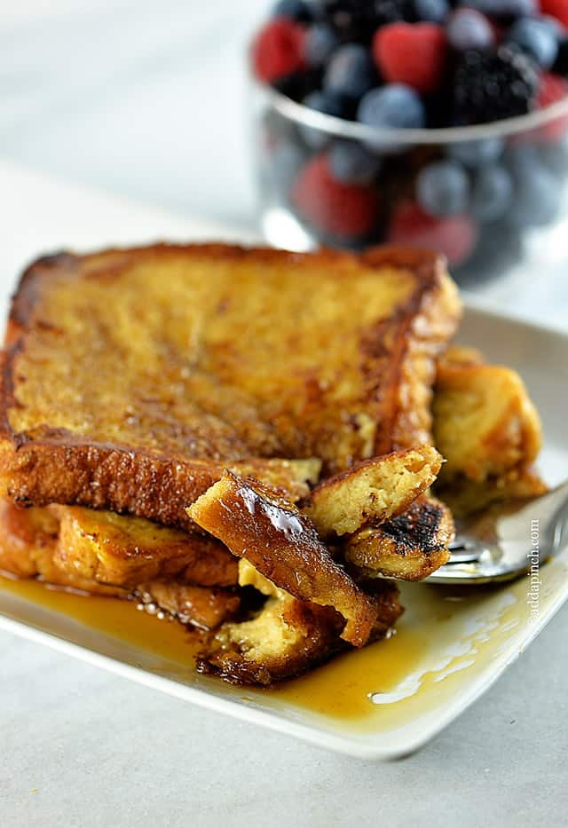

## Vegan French Toast Recipe 

Adapted from this
[McCormick](https://www.mccormick.com/recipes/breakfast-brunch/quick-and-easy-french-toast)
recipe, photo courtesy of [Add a
Pinch.](https://addapinch.com/perfect-french-toast-recipe/)

This French toast recipe is one I make all the time with my family but
adapted to be vegan! This should be an easy recipe to make, and it is an
American favorite!

### Tools: 

-   Electric fry pan (found in the cabinet next to the fridge)

-   Spatula (found in the drawer on the left side of the sink)

-   Large bowl (found in the cabinet on the left side of the sink)

-   Pam cooking spray (found in the cabinet above the stove)

### Ingredients: 

-   Dave's Killer bread (4 slices)

-   JUST Egg (3 tbsp)

-   Vanilla extract (1 tsp)

-   Ground cinnamon (½ tsp)

-   Almond Breeze Dairy-Free Almond milk (¼ cup)

-   Maple syrup

-   Earth balance butter

### Directions: 

#### *Preparation:* 

1. Plug in and preheat the electric fry pan to 350 degrees.

2. Mix JUST egg, almond milk, vanilla extract, ground cinnamon in the
    mixing bowl.

#### *Cook:*

3. Spray the electric fry pan with Pam.

4. Dip the bread into the egg mixture, coat on both sides.

5. Place the bread on the skillet and cook for about one minute.

    -   NOTE: The underside of the bread should be golden brown before
        you flip.

6. Flip the bread, cook the other side for another minute.

7. Take the bread off the electric fry pan and place it on a plate.

8. Repeat process until all bread slices are cooked.

    -   NOTE: Feel free to cook multiple slices of bread at once.

#### *Enjoy:*

1. Plate the French toast and top with maple syrup and a pat of earth
    balance butter.

2. Enjoy!

